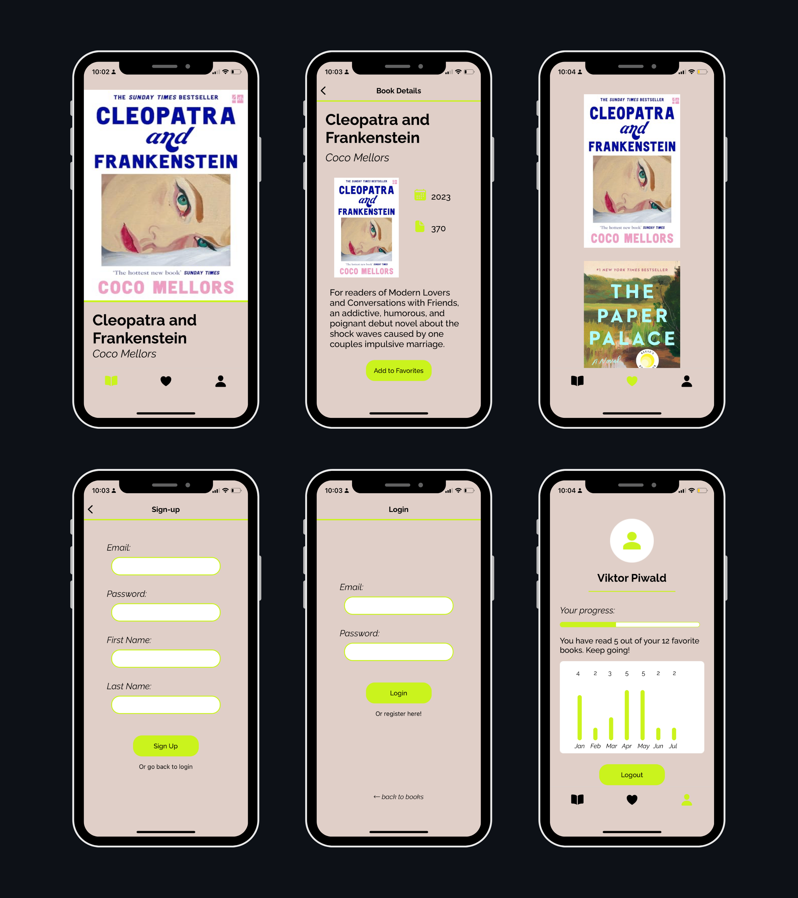

<h1>Book Inspiration App 📚</h1>

<h2>About this project 📝</h2>
The book inspiration app is a full-stack react native and expo project, where users get three book inspirations daily and can save it to their favorites. 
Main features are:

- inspiration screen: here a user can find three different books on a daily basis
- book detail screen: when a book is clicked by the user, it directs to this screen, where title, author, book description, publishing year, book cover and number of pages can be found
- favorites screen: a user can save the daily books to the favorites screen, where all saved books are visible after logging in
- profile screen: shows the user's profile after logging in
- login / signup screen: users need to authenticate and authorize to use the features

This app features Stack and Tab Navigation powered by React navigation that allows users to navigate easily within the application.

<h2>Technologies ⚛️ </h2>

- Typescript / Javascript
- React Native with Expo
- PostgreSQL
- Expo Router
- Expo API Route
- React navigation
- Node.js

<h3> Prototyping </h3>

- <a href="https://www.figma.com/file/TGqqnsSnFT4GQNSfARccEL/Final-project---app?type=design&node-id=12%3A1053&mode=design&t=9d6NaawxutprA8ZX-1">Figma</a>
- <a href="https://drawsql.app/teams/jules-team-2/diagrams/final-project">DrawSQL</a>

<h2>Screenshots 📷</h2>

<h3>Final Look </h3>
<p align="left">
  
</p>

<h3>Prototype on Figma</h3>

- <a href="https://www.figma.com/file/TGqqnsSnFT4GQNSfARccEL/Final-project---app?type=design&node-id=0%3A1&mode=design&t=9d6NaawxutprA8ZX-1">Brainstorming</a> for colors and splash screen
- <a href="https://www.figma.com/file/TGqqnsSnFT4GQNSfARccEL/Final-project---app?type=design&node-id=12%3A1053&mode=design&t=9d6NaawxutprA8ZX-1">Prototype</a> for app

<h2>Setup 💻</h2>

1. Clone the repository

```
git clone https://github.com/julessre/book-inspo-app
cd book-inspo-app
```

2. Install dependencies using

```
pnpm install
```

3. Setup postgres database

Create a file called .env in the project root directory and paste the following, changing to your own username, password and database:

```
PGHOST=localhost
PGUSERNAME=<your username>
PGPASSWORD=<your password>
PGDATABASE=<your database>
```

4. Connect to postgres database and run either:

```
psql -U <user name> <database name> on windows and macOS
sudo -u <user name> psql -U <user name> <database name> on Linux
```

5. Migrate database and run:

```
pnpm migrate up
```

6. Run application

```
pnpm start
```

7. Open Android Studio.
